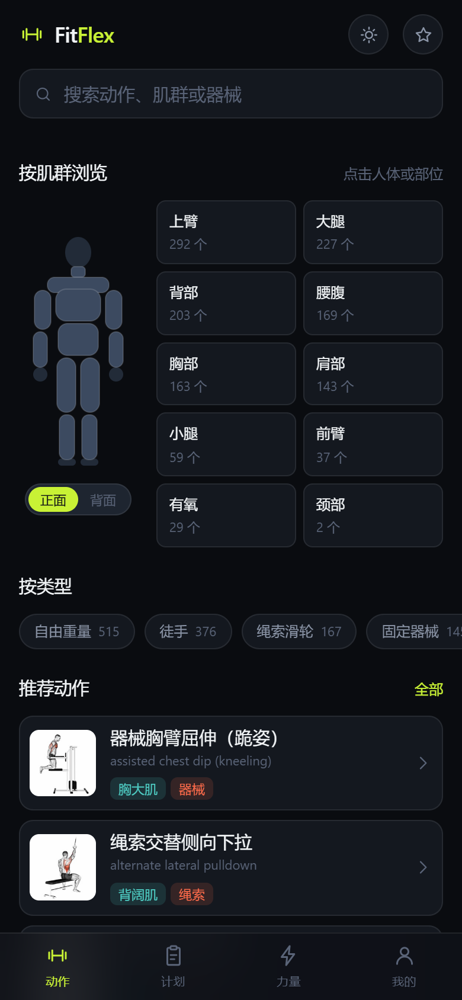
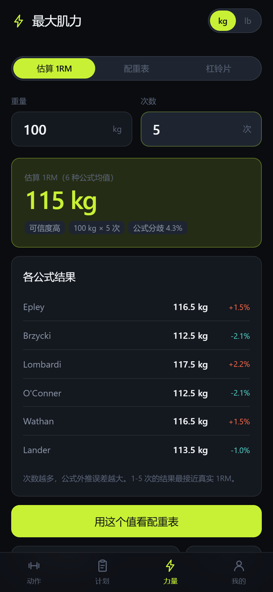

# FitFlex · 健身工具箱

**1324 个健身动作的离线查询工具 + 训练计划 + 最大肌力估算。** 手机优先，首屏 25.6 KB（gzip），装上后断网也能用。

<p align="center">
  
  
  
</p>

**在线体验**：<https://a68d1ab7fcaa43a18a747d860798887d.sg.agentos-app.run>
（手机打开 → 停留约 10 秒完成缓存 → 「我的」页显示「离线已就绪」→ 之后可断网使用）

---

## 功能

### 动作库

- **1324 个动作**，覆盖胸/背/腿/肩/臂/核心/有氧 10 个部位
- **人体肌群导航**：点人体图上的部位直接筛选，支持正面/背面切换
- **多维度筛选**：肌群 × 器械 × 动作类型，可叠加
- **中文全文搜索**：1324 个动作名 **100% 中文化**，零重名、零残名
- **动作详情**：目标肌群、协同肌群、分步说明、动作要点，点击可加载动画演示

### 训练计划

5 套内置模板，动作与组数按真实训练实践编排：

| 模板 | 目标 | 等级 | 结构 |
|---|---|---|---|
| 推拉腿三分化 | 增肌 | 进阶 | 推 / 拉 / 腿，每周 3 或 6 练 |
| 上下肢两分化 | 增肌 | 进阶 | 上肢A / 下肢A / 上肢B / 下肢B |
| 五分化训练 | 增肌 | 高阶 | 胸 / 背 / 腿 / 肩 / 臂 |
| 新手全身训练 | 综合 | 新手 | 全身 A / B / C，每周 3 练 |
| 力量优先 5×5 | 最大力量 | 进阶 | 深蹲 / 卧推 / 硬拉 / 推举 |

- **逐组打卡**：点圆点标记完成组数，进度自动保存在本机
- **可编辑**：复制模板到「我的计划」后，自由增删动作、调整组数/次数/休息
- 每个动作可直接点进详情页看图文与动画

### 最大肌力

- **1RM 估算**：同时用 6 种经典公式计算并取均值
  （Epley / Brzycki / Lombardi / O'Conner / Wathan / Lander），
  给出公式分歧度与可信度分级（≤5 次高、6-10 次中、>10 次低）
- **配重表**：9 档强度区（100% → 60%），每档标注训练目标、次数、组数、组间休息
- **杠铃片计算器**：算出每边该挂哪些片，支持 kg（杆 20）与 lb（杆 45）双单位
- **1RM 档案**：按动作保存历史记录，追踪涨跌

### 其他

- 收藏、深色/浅色主题、**离线状态指示**

---

## 技术要点

| | |
|---|---|
| 前端 | TypeScript + 原生 DOM，**零运行时依赖** |
| 构建 | esbuild（不是 Vite，见下） |
| 样式 | 原生 CSS + 设计令牌，深色优先 |
| 数据处理 | Python 3.13（规则式译名流水线） |
| 离线 | Service Worker，外壳 + 全量数据预缓存 |

### 体积

```
JS   59.4 KB  (gzip 19.4 KB)
CSS  33.2 KB  (gzip  6.2 KB)
首屏关键体积  25.6 KB gzip
离线缓存总量  ~1.6 MB
```

### 数据是怎么变小的

原始数据集 17 MB（含 10 种语言）→ 归一化为 2.73 MB 种子文件 →
前端索引 **176 KB**（gzip 约 50 KB）。

- **列式 JSON 存储**：`{cols, rows}` 数组而非对象数组，省约 40% 体积
- **详情按需分片**：详情数据按 id 前两位分成 37 个分片，只在打开详情时拉取
- **媒体不落仓库**：图片与 GIF 走 jsDelivr CDN，按需加载

### 中文译名流水线

1324 个动作名全部由规则式流水线生成，要求幂等、可重复执行、零重名。

- 术语表匹配 + 词形还原 + 最长匹配优先的短语翻译
- 重名消歧阶梯：器械词 → 限定语 → 序号（序号是最后一档）
- 改完自动校验：零重名 / 无残名 / 无单字 / 序号健康 / 无英文残留
- 连跑两次「实际改动 0 条」验证幂等

细节见 `tools/improve_names.py` 与 `tools/export_name_review.py`。

---

## 快速开始

```bash
npm install
npm run build      # tsc --noEmit && node tools/build.mjs
npm run preview    # http://127.0.0.1:4173
```

开发时用：

```bash
npm run typecheck
```

手机真机调试（暴露到局域网）：

```bash
HOST=0.0.0.0 node tools/serve.mjs
```

> ⚠️ **项目路径不能含 `#` 字符。** 本项目开发时位于 `D:\#AI\...`，
> Vite 内部把路径转 URL 时会把 `#` 当片段分隔符，报 `EISDIR`。
> 因此构建改用 esbuild。若你的路径不含 `#`，用 Vite 也可以。

### 重新生成数据

需要 Python 3.13。三步顺序不能乱：

```bash
python tools/normalize_dataset.py    # 原始数据 → 种子文件（仅首次或换数据源）
python tools/improve_names.py        # 生成中文译名
python tools/build_dataset.py        # 生成前端产物到 public/data/
npm run build
```

---

## 项目结构

```
src/
  core/          数据层
    types.ts       类型定义
    dataset.ts     数据加载（索引 / facets / 详情分片）
    search.ts      中文检索与评分
    store.ts       全局状态 + localStorage
    plan.ts        训练计划：模板 + 持久化
    onerm.ts       1RM 公式、强度区、杠铃片计算
    offline.ts     离线缓存状态检测
    dom.ts         极简 DOM 工具
  components/    组件
    icons.ts       内联 SVG 图标
    bodymap.ts     人体肌群导航图
    card.ts        动作卡片 + 图片懒加载
    tabbar.ts      底部主导航
    planEditor.ts  计划编辑抽屉
    toast.ts       轻提示
  views/         页面
    home.ts        动作库首页
    list.ts        结果列表
    detail.ts      动作详情
    favorites.ts   收藏
    plans.ts       计划列表
    planDetail.ts  计划详情 + 打卡
    strength.ts    最大肌力
    me.ts          我的
  styles/
    tokens.css     设计令牌（颜色/间距/字号）
    base.css       基础与通用组件
    modules.css    计划 / 力量模块样式
  router.ts      hash 路由
  main.ts        启动与渲染

tools/
  normalize_dataset.py    原始数据归一化
  terms_zh.py             中文术语表（人工定名写这里）
  improve_names.py        译名流水线主脚本
  export_name_review.py   译名校验 + 导出校对表
  build_dataset.py        生成前端数据产物
  build.mjs               esbuild 构建
  serve.mjs               本地预览服务器

data/
  exercises.seed.json         归一化种子（1324 条）
  exercises.seed.json.baseline 流水线输入基线
  name-review.csv             译名人工校对表

public/
  data/           前端数据产物（索引 / facets / 37 个详情分片）
  sw.js           Service Worker
  manifest.webmanifest
  icon.svg
```

---

## 部署

项目是纯静态站点，`npm run build` 产物在 `dist/`。

发布用 `site/` 目录（构建时自动从 `dist/` 同步）——某些部署工具会把名为
`dist` 的目录当构建产物排除。

Service Worker 的预缓存清单由构建时注入（`public/sw.js` 里的 `__PRECACHE__`
占位符），因为 JS/CSS 文件名带 hash，静态文件拿不到。

---

## 数据来源与许可

- 动作数据：[hasaneyldrm/exercises-dataset](https://github.com/hasaneyldrm/exercises-dataset)（MIT）
- 图片与动画：© [Gym visual](https://gymvisual.com/)，仅作演示用途，**不随本仓库分发**
- 本仓库代码：MIT

收藏、训练进度、1RM 记录全部保存在浏览器 localStorage，不会上传。

---

## 已知限制

- 内网 http 访问时 Service Worker 不注册（非安全上下文），离线与「安装到桌面」不可用，
  需要 HTTPS 或 localhost
- 详情分片预热约需 10 秒（1.6 MB），期间功能可用但尚未完全离线
